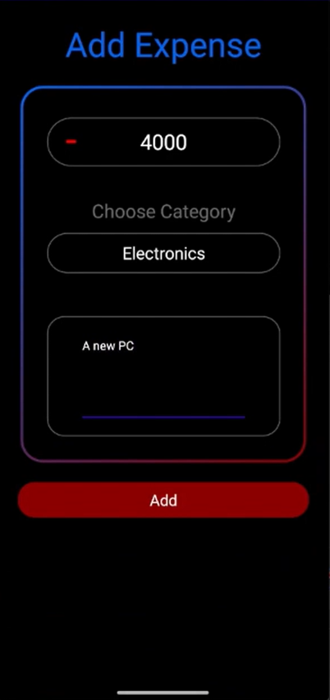
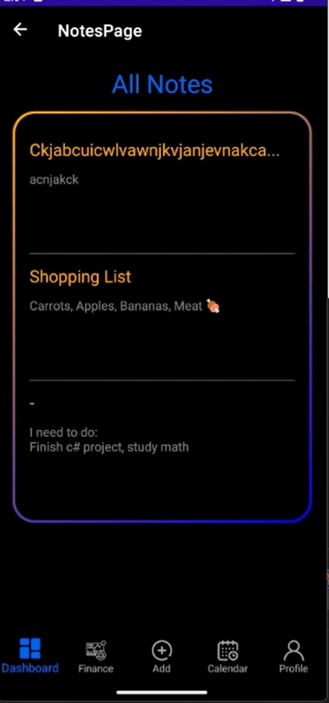
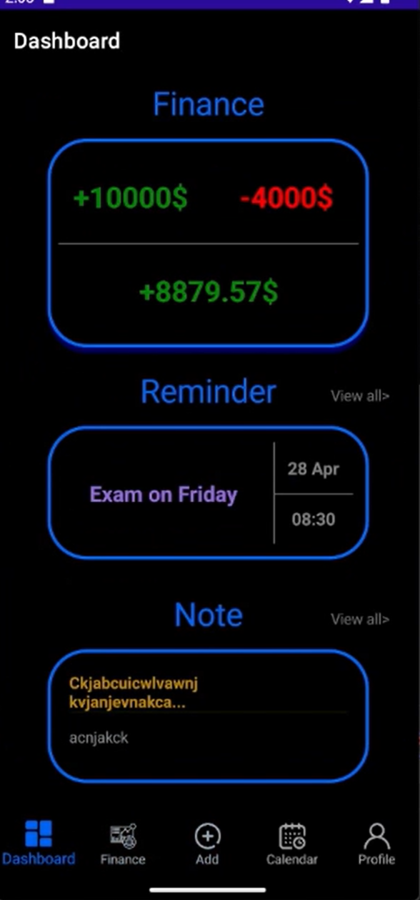

Managing Finances, Notes, and Reminders in One Platform
Addressing Inefficiencies in Traditional Management Methods
Providing User-Friendly Interfaces for Efficient Management
Implementing Reminder Functionalities for Task Management.
Dashboard:

Add Page:

Notes List:

Complete Dashboard:

